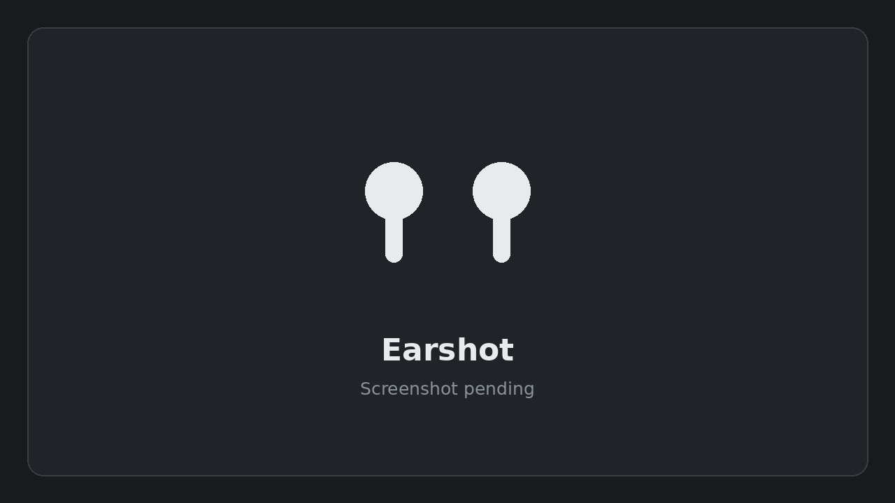

<div align="center">

# Earshot

### A Windows 11 tray utility that keeps AirPods off the PC until you ask for them

 &nbsp; &nbsp;[](https://github.com/5Muawiyah/earshot/actions/workflows/build.yml) &nbsp;

</div>

<p align="center"></p>

<p align="center"><i>Earshot in the tray: click the icon, then Connect on the card, and it says what happened.</i></p>

Muawiyah Jahanzaib built Earshot because Windows pages every paired Bluetooth
device when the PC powers on, including AirPods that were left on a phone in
the middle of something, and there is no per-device setting to stop it. Earshot
disables the AirPods' own Bluetooth device nodes while they are not in use on
the PC, so Windows has nothing to page at boot; connects and disconnects them
from a click on the tray icon's card; and blocks the Hands-Free profile so a
browser tab or a game cannot drop them to call quality.

| Document | What it covers |
|---|---|
| [Overview](docs/overview.md) | what Earshot does, a tour of the tray, its menu and the AirPods widget, in plain English |
| [Architecture](docs/architecture.md) | how it works, the safety model, setup and removal, the command line |
| [Requirements](docs/requirements.md) | what Earshot has to do, the test that proves each point, and what it does not do |
| [Verification](docs/verification.md) | the verification table and the live-test evidence behind it |
| [Glossary](docs/glossary.md) | the terms, in plain English |
| [Live test guide](tools/live-tests/README.md) | how to run the live tests by hand, and how to put the machine back if one stops in the middle |
| [Third-party notices](THIRD-PARTY-NOTICES.txt) | every third-party component a release carries, its publisher, its licence and where to read the terms |

## The problem

When the PC powers on, Windows pages every paired Bluetooth device. The
AirPods accept, and they leave the phone in the middle of whatever you were
listening to. There is no per-device setting to stop this. Microsoft's answer
is that a paired device cannot be stopped from connecting automatically, other
than by unpairing it or turning Bluetooth off:
https://learn.microsoft.com/en-us/answers/questions/4093792/how-to-prevent-windows-from-automatically-connecti

Earshot takes the other route. It disables the AirPods' own Bluetooth device
nodes while you are not using them on the PC. A disabled node is designed to
stay disabled across a restart, so Windows has nothing to page at boot. The
power cycle test that checks this (test 08) has not run yet, and a shut down
with Fast Startup on is not covered. The pairing is untouched, so enabling the
nodes again is quick: left-click the Earshot icon, then Connect on the card.

## What it does

- **Stops Windows paging the AirPods at boot**, with Block at boot turned on.
- **Connects and disconnects the AirPods**: left-click the Earshot icon, then
  Connect or Disconnect on the card.
- **Blocks the Hands-Free profile**, on by default, so a browser tab or a game
  cannot drop the AirPods to a narrow voice channel. This turns off the
  AirPods microphone on this PC while it is on.
- **Hands the AirPods back at shut down, sleep and Exit**, off by default.
  With **Hand back on shut down, sleep and Exit** ticked (in the menu and on
  the card's settings page), Earshot lets the AirPods go, confirms it, and
  blocks the device nodes again before this PC can grab them back. A stuck
  disconnect still gets the block. Until you tick it, Exit while the AirPods
  are in use closes Earshot without blocking them, and says so. The tests cover it against stand-ins; it has not had a
  live run (tests 17, 18 and 20 are pending).
- **The AirPods widget.** A gauge on the taskbar (the earbud mark with a ring
  in your Windows accent colour, and the lower proved bud's number), a card
  with a settings page behind its gear, and a low battery alert. It listens to
  the AirPods' own Bluetooth broadcast, so it needs no connection. A battery
  figure shows only once **Set up battery** has proved that field: open the
  case by the PC, tell Earshot what your iPhone shows, and do it twice. Until
  then the gauge shows the earbud mark alone. Set-up cannot prove whether a bud
  is in the ear or whether the case lid is open, so ear detection, auto-pause
  and the case-open card stay off. The widget has not had a live run. See
  [docs/overview.md](docs/overview.md#the-airpods-widget) and
  [docs/architecture.md](docs/architecture.md#the-airpods-widget).
- **Shortcuts, on by default.** Ctrl+Alt+Shift+A connects (switches the
  AirPods to this PC) and Ctrl+Alt+Shift+D disconnects (switches them to the
  phone). Both can be changed or cleared on the settings page. Nobody has
  pressed one on a real run yet (test 16 is pending).
- **Pause when the AirPods leave this PC**, on by default. If this PC was
  playing to the AirPods when they leave, Earshot pauses the one media session
  that is playing. It never resumes anything.
- **Updates.** **Check for updates** is in the menu and on the settings page.
  **Check automatically** is off by default, because a check contacts GitHub.
  Nothing downloads until you press Update. Update works from whichever copy
  is running, including one unzipped in a download folder and one newer than
  the installed copy, as long as Earshot is installed in Program Files: the
  update always runs the installed program, which is in a folder only
  administrators can change, never the running one. Earshot finishes its own
  closing work first (with Hand back on, that hands the AirPods back and
  blocks them), then shows the one administrator prompt, then ends. If the
  prompt is declined after that, the card says so and Earshot starts again.
  Only one setup, repair or update runs at a time, and the menu and the card
  say why while one does. See
  [docs/architecture.md](docs/architecture.md#updates) for what the checksum
  does and does not protect against.
- **Repair Earshot.** **Repair Earshot...** is in the menu, and on the
  settings page beside Check for updates, whenever Earshot is installed, in
  any state. It checks every installed file against the list the release
  published, and the route depends on what it finds:
  - Every file matches: the installed Earshot repairs itself and registers the
    tasks and the service again.
  - A file is missing or does not match: it downloads the release of the
    version you have installed, checks it the way an update is checked, and
    hands it to the installed Earshot's update, so the files come back only
    from checked bytes.
  - A file or the file list could not be read, or the install folder's
    permissions could not be read (another program holds it open, or access
    was refused): nothing is changed and Earshot says to try again. A file
    that could not be read says nothing about what is in it.
  - Every file matches but the installed version could not be read (or the
    file carries none): the installed Earshot's install verb runs, which every
    version runs from its own folder as the same repair. If a file is also
    missing or different, nothing is changed, because the release to download
    is named by the installed version.
  - The running copy is newer than the installed one: Repair does not run it
    elevated. It opens the update path (Check for updates, then Update).
  - Earshot.exe is truly missing from Program Files, or its folder can be
    changed by a standard user: the running copy's own setup puts a new
    install in place, so that copy must be an unzipped release you downloaded
    and checked.

  Each route asks for one administrator prompt, or none when it only tells you
  something. Your settings, battery set-up and chosen AirPods are kept. A copy
  run from a download folder never points Open on startup or the Start menu
  shortcut at itself once Earshot is installed, and offers to switch to the
  installed copy: a switch closes that copy first, which with Hand back on
  hands the AirPods back and blocks them. A copy started as an administrator
  offers no switch, because the installed copy would start as an administrator
  too: start it from the Start menu. Exit waits for a setup or repair that is
  still running before it hands back and blocks.
- **Spoken status and playing audio from a phone**, both off by default and
  neither with a live run.
- **A small background service for the hand-back.** When the Earshot icon has
  been closed or has crashed, nothing in the tray can hand the AirPods back at
  shut down. A Windows service, `EarshotHandBack`, covers that case: at shut
  down it checks whether the AirPods are already blocked and, if they are not,
  blocks them. It acts only when Block at boot and Hand back are both on, and
  Hand back is off by default, so until you tick it the service does nothing
  at shut down. It never disconnects the AirPods. It takes no
  requests from any program, and reads its settings only from a folder that
  standard users cannot write to. Setup installs it and uninstall removes it.
  It does not cover a shut down with Fast Startup on, which Windows may
  finish without telling services, and whether a restart gives it the
  shut-down notice is not proved. It has not had a live run yet.

See [docs/requirements.md](docs/requirements.md) for what each point promises
and the test that proves it, and [docs/overview.md](docs/overview.md) for a
plain-English tour of the tray.

## Getting started

1. Get `Earshot-<version>-win-x64.zip`. The zip is built from this repository
   by `tools\build-release.ps1`, which writes it to `artifacts\` with a
   `.sha256` file beside it and prints its size and SHA-256. Check that hash
   against the copy you were given before you unzip it, because setup copies
   these files into Program Files. The checksum shows the download matches
   what was published. It does not protect against a compromised release or
   account, because the checksum comes from the same release, and the app is
   not signed.
2. Unzip it anywhere. You get an `Earshot` folder.
3. Run `Earshot.exe`. An earbud icon appears in the notification area. By
   default the earbud then shows on the taskbar instead, and the tray icon
   hides once it does.
4. Right click the earbud on the taskbar, or the tray icon if that is what
   shows, and choose **Set up Earshot...**. Windows shows one
   administrator prompt. The item appears only when nothing is installed.
   Once Earshot is installed, in any state, the menu says **Repair
   Earshot...** in its place.

To update later, use **Check for updates** in the menu, from any copy. Nothing
needs setting up again first. If an install is damaged, choose **Repair
Earshot...**. Repair never installs from a copy that is only unzipped in a
folder once Earshot is installed: a newer copy goes through Update.

Connect and disconnect do not need setup. Block at boot and Protect audio
quality do, because both change the device through Earshot's SYSTEM tasks.

Requirements: Windows 11 on x64, which is what Earshot is built for and
tested on. Play from a phone and the AirPods widget need Windows 10 version 2004
(build 19041) or later, which every Windows 11 has. Otherwise: the AirPods paired to this PC and connected to it at
least once, so Windows has created their device nodes; one administrator
approval, for setup; nothing else to install, because the release is
self-contained.

Settings are in `%APPDATA%\Earshot\settings.json`. The hand-back setting
(`HandBackOnShutdownAndSleep`) and the service's `HandBackAtShutdown` read as
off when they are absent. Logs, live-test evidence
and the widget's claim, set-up records and proof are in
`%LOCALAPPDATA%\Earshot`. The files the elevated tasks and the service read
are in `%ProgramData%\Earshot`.

To remove Earshot, turn **Open on startup** off in the menu, close Earshot,
then run `& "C:\Program Files\Earshot\Earshot.exe" uninstall` from an
administrator PowerShell (in Command Prompt, leave out the `&`). See
[docs/architecture.md](docs/architecture.md#setup-and-removal) for what that
does and how it reports a step it could not finish.

## Install with AI

Copy the prompt below and paste it into any AI chat. It asks whether you want
to install, update or uninstall, then does the steps or walks you through them.

```
You are helping me install, update or uninstall Earshot, a Windows tray app for AirPods. Be short and plain, in British English.

First ask me which I want: install, update or uninstall. Wait for my answer.

If you can run commands on my PC, do the steps yourself. If you cannot, give me one step at a time and wait for me to tell you the result before the next.

Rules:
- Download only from https://github.com/5Muawiyah/earshot/releases/latest . You need two files: Earshot-<version>-win-x64.zip and Earshot-<version>-win-x64.zip.sha256. The checksum file is one line: the zip's SHA-256 in lower case, two spaces, then the zip's name. The release notes on that page print the SHA-256 too.
- Compute the zip's hash in Windows PowerShell with: Get-FileHash -Algorithm SHA256 <zip>
- Compare its Hash with the checksum file and with the release notes, ignoring case. Stop unless you computed the hash and it matches both. Do not unzip before then.
- The checksum shows the download matches what was published. It does not protect against a compromised release or account, because the checksum comes from the same release, and the app is not signed. Say so to me plainly.
- Then unzip with: Expand-Archive <zip> -DestinationPath <folder> . This gives one folder called Earshot.
- Never turn off SmartScreen, Defender, Secure Boot or any other protection. Never unblock files in bulk. Never run any other script from the internet.
- Earshot is not code-signed, so SmartScreen may warn. Tell me plainly: the app is unsigned, and the checksum shows the download matches what was published. Let me decide whether to go on.
- Before any administrator prompt, tell me one is coming. I approve it myself. Do not try to approve it for me.

Install:
1. Run Earshot.exe from the unzipped Earshot folder. An earbud icon appears in the notification area. By default the earbud then shows on the taskbar instead, and the tray icon hides once it does.
2. I right-click the earbud on the taskbar, or the tray icon if that is what shows, and choose "Set up Earshot...". Windows shows one administrator prompt.
3. Setup copies Earshot into C:\Program Files\Earshot and installs its scheduled tasks and a small Windows service that, when Block at boot and Hand back are both on, blocks the AirPods at shut down if Earshot itself could not.

Update (my settings in %APPDATA%\Earshot and my battery set-up in %LOCALAPPDATA%\Earshot are kept):
- The way to update is "Check for updates" in Earshot's menu, then the Update button on the card that opens. It works from whichever copy of Earshot is running, even one unzipped in a download folder and even one newer than the installed copy, as long as Earshot is installed in C:\Program Files\Earshot. It downloads the new release, checks its SHA-256, finishes Earshot's own closing work (with Hand back on, that hands my AirPods back and blocks them), shows one administrator prompt and then ends Earshot. I start Earshot again from the Start menu afterwards. Nothing needs setting up first. If I decline the prompt, Earshot says so and starts again.
- If the card says to set up first, nothing is installed: choose "Set up Earshot..." instead. If it says to repair first, the install is damaged: choose "Repair Earshot...".
- There is no other way to update. Repair does not install a newer release from an unzipped copy when Earshot is already installed: from a newer copy it opens the same Check for updates. Only one setup, update or repair can run at a time.

Repair (my settings and battery set-up are kept):
- If Earshot is installed but something is wrong, I choose "Repair Earshot..." in its menu, or on the settings page beside "Check for updates". It checks every installed file against the release's own list. If they all match it registers the scheduled tasks and the service again. If a file is missing or different it downloads the release of the installed version, checks its SHA-256 and installs it. If a file could not be read (another program holds it open), nothing is changed and I try again. If the running copy is newer than the installed one, it opens Check for updates instead. One administrator prompt at most.
- If C:\Program Files\Earshot\Earshot.exe itself is missing (its folder lists without it), the same menu item repairs from the copy that is running, which must be an unzipped release I downloaded and checked as above.

Uninstall:
1. I turn "Open on startup" off in Earshot's menu, then choose Exit.
2. In an administrator PowerShell, run exactly: & "C:\Program Files\Earshot\Earshot.exe" uninstall
   In Command Prompt, run the same without the &.
   If C:\Program Files\Earshot\Earshot.exe is missing (a damaged install), run the same command with the Earshot.exe from a release you downloaded and checked as above.
3. This removes C:\Program Files\Earshot, C:\ProgramData\Earshot, the scheduled tasks and the service. It turns the AirPods' device entries back on, so Windows pages them at boot again. It leaves %APPDATA%\Earshot, which holds my settings, and %LOCALAPPDATA%\Earshot, which holds logs, test evidence and the battery set-up records. If it reports a step it could not finish (for example a folder it will remove at the next restart), tell me exactly what it said.
4. Ask me before deleting those two folders. Delete them only if I say so.
```

## Build and testing

The .NET SDK 10 on Windows x64.

    dotnet build Earshot.slnx
    dotnet test Earshot.slnx

`tools\check.ps1` rebuilds from scratch, runs the tests, runs the live-test
self-test against a fake machine, and fails if any compiler or analyser
warning is suppressed anywhere in the solution.

`tools\build-release.ps1` publishes the self-contained win-x64 folder, checks
every published file against the manifest the build writes, zips it to
`artifacts\Earshot-<version>-win-x64.zip`, and prints the zip's size and
SHA-256. The version comes from `src\Earshot\Earshot.csproj`.

`Earshot.pdb` is published, listed in the manifest and installed on purpose:
it turns the stack trace in a logged exception into file names and line
numbers, and the log is where Earshot reports the failures it will not
swallow.

`prototype\` holds the three PowerShell scripts that blocked the AirPods
before Earshot existed. They are superseded and kept only for reference.

The live device tests under `tools\live-tests` are run by hand, on real
AirPods, and are never run by a build. See
[docs/verification.md](docs/verification.md) for what each one checks, how it
is run, and which have run so far.

## Licence

Earshot's own code is MIT licensed: see [LICENSE](LICENSE). A release also
carries Microsoft files that are not. `Microsoft.Windows.SDK.NET.dll` and
`WinRT.Runtime.dll` ship unmodified under the Microsoft Windows SDK licence
terms (https://learn.microsoft.com/en-us/legal/windows-sdk/license), which
the MIT licence does not replace, so pass a release on whole and under terms
that protect those two files at least as much as Microsoft's do.
[`THIRD-PARTY-NOTICES.txt`](THIRD-PARTY-NOTICES.txt), in the repository and
in every release, names each third-party component, its publisher, its
licence and where its terms can be read.

---

<div align="center"><sub>Built by Muawiyah Jahanzaib. MIT licensed. The live tests are run by hand on real AirPods; the verification table says which have been.</sub></div>
