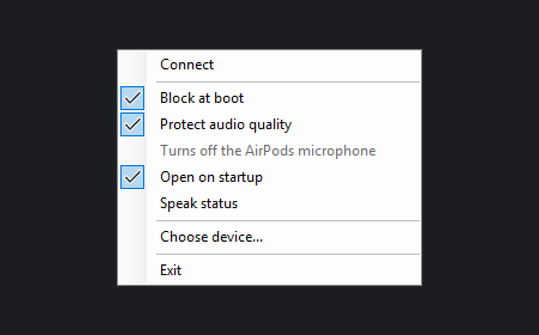
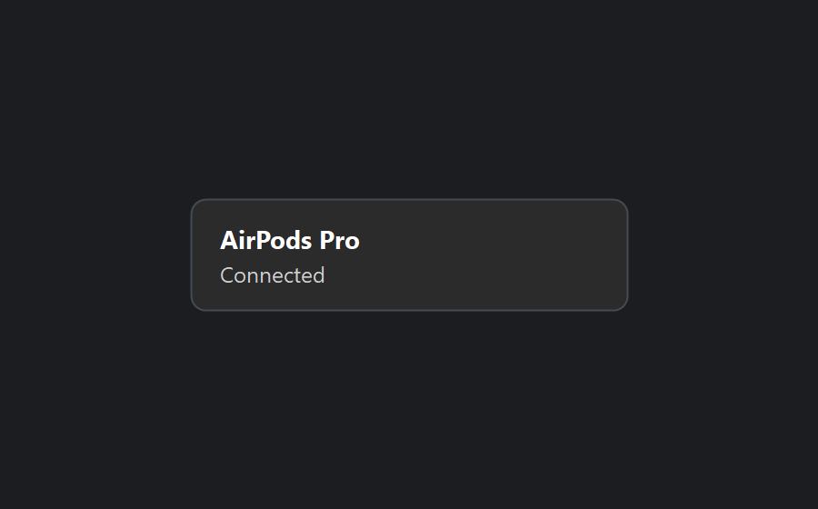
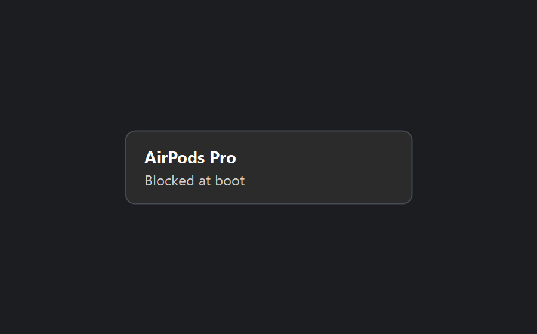
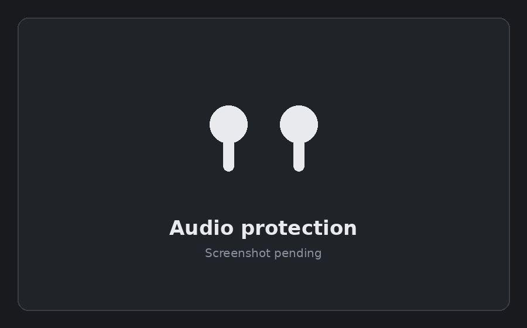

# Overview

This page is for anyone using Earshot, not just for engineers. It explains
what the tray icon shows, what each menu item does, and what the small cards
near the tray mean, without needing to know how any of it is built. For the
mechanism behind it, see [architecture.md](architecture.md).

## What Earshot is for

Windows connects every paired Bluetooth device the moment the PC turns on.
For a pair of AirPods that is usually the wrong moment: they get pulled off a
phone mid-call or mid-podcast, with nothing on the PC actually wanting them
yet. Earshot stops that by switching the AirPods off at the Windows level
while nobody is using them on this PC, and switches them straight back on
with one click when someone is.

It also stops something quieter: Windows can drop a Bluetooth headset from
its normal stereo sound down to a narrow, phone-call-quality channel the
moment any program opens a microphone. Earshot can turn that fallback off for
the AirPods, so a browser tab asking for a microphone cannot pull them down
to that channel while it is on. Turning it on costs you the AirPods
microphone on this PC.

## The tray icon

A left click connects or disconnects the AirPods, whichever they are not
already doing. The icon itself shows which of four states they are in:

| Icon | Meaning |
|---|---|
| Outlined earbuds | Disconnected |
| Solid earbuds | Connected |
| Faded solid earbuds | Busy: connecting, disconnecting or allowing |
| Outlined earbuds with one diagonal slash | Blocked at boot |

Hovering over the icon reads `Earshot: <device name> - connected`, and
likewise `disconnected`, `blocked` or `not found`. If Earshot cannot read the
audio devices at all it says `unknown`, rather than guessing at one of the
four states.

<i>The right-click menu on a PC that is set up, with the AirPods disconnected.</i>

## The right-click menu

Top to bottom, with the exact wording:

| Item | What it does |
|---|---|
| `Safe mode: no device actions` | A caption, not a command. Shown only when Earshot is running in a mode that turns every device action off, used for testing. |
| `Connect`, or `Disconnect` when connected | The same as a left click. Greyed out while a change is already under way. |
| `Play from a phone` | Shown only once this v1.1 setting is turned on. Opens a submenu listing the phones paired in Windows that can send audio to this PC, with `Refresh the list` and, once one is open, `Stop playing from <name>`. Greyed out before Windows 10 version 2004 (build 19041). |
| `Block at boot` | A tick. Keeps the AirPods' device nodes disabled while they are not in use. Turning it on before setup has run starts setup. The tick shows what is in force; when the setting cannot be read it shows neither state. |
| `Hand back at shut down and sleep` | A tick, on by default. Releases the AirPods and blocks the device nodes again when you shut down, restart or put the computer to sleep, so it does not grab them straight back. See [below](#handing-the-airpods-back). |
| `Protect audio quality` | A tick, on by default. Turns off the Hands-Free profile, described above. |
| `Turns off the AirPods microphone` | A caption under that setting, always visible and never clickable, telling you plainly what it costs. |
| `Open on startup` | A tick, on by default. Writes one value named `Earshot` under the current user's `Run` key, with the `--startup` argument. Earshot has to be running for it to put the block back once you stop using the AirPods, so this keeps it running from sign-in. |
| `Speak status`, or `Speak status (no voice)` when no speech voice is installed | A tick, off by default, for this v1.1 feature. Clicking it does not itself speak anything. |
| `Choose device...` | Lists the Bluetooth devices paired to this PC, so you can point Earshot at a different one, for instance if your AirPods were renamed, so that the default match "AirPods" no longer fits. Choosing one pins it, and points the elevated worker at the same device. A device that cannot play audio from this PC, a phone for instance, is refused. |
| `Set up Earshot...` | Runs the one-time setup. Shown only while setup is still needed. |
| `Exit` | Closes Earshot. With Block at boot on, it blocks the device nodes first. |

Once a keyboard shortcut is set and switched on, it is shown beside the
item's own label, for instance `Connect (Ctrl+Alt+P)`.

 

## The connect and disconnect card

A small card appears near the tray with the device name and what is
happening, then closes itself without taking the focus away from whatever you
were doing. If the AirPods do not arrive the ordinary way, the card says so
honestly, for instance "Trying another way" while Earshot works around a
driver refusal.

<i>The card Earshot shows near the tray when the AirPods connect.</i>

 

## The boot block

With Block at boot ticked, the AirPods' device nodes are disabled the moment
they stop being used, and stay disabled through a restart. Nothing has to run
at shutdown for that to hold; staying disabled is the steady state, and it is
what stops Windows paging them at the next boot.

<i>The card Earshot shows when the AirPods are blocked at boot.</i>

 

## Audio quality protection

With Protect audio quality ticked, Windows has no Hands-Free profile left to
fall back to, so a browser tab or a game asking for a microphone cannot pull
the AirPods down to a narrow voice channel. This does not make the sound
better than usual; it stops something else from making it worse. The tray
says plainly that the setting turns off the AirPods microphone on this PC
while it is on.

Connecting can need the setting off for a moment, because the quick reconnect
Earshot uses depends on the very profile this setting turns off. If Windows
refuses the quicker way, the card says "Trying another way": Earshot turns
the protection off, connects, then turns it back on, and the microphone works
again on this PC while that runs. If putting the protection back fails, the
card says "Connected, but audio quality protection did not apply." and the
microphone stays available until the next connect fixes it.

<i>The notice Earshot shows when audio quality protection is switched on.</i>

 

## v1.1 features

These three are built and reviewed, but off by default, and none has been
tried on real hardware yet: no shortcut has been pressed for real, nobody has
heard Earshot speak, and no phone has actually played through it. Turning any
of them on is switching on something unverified in practice.

**Keyboard shortcuts.** Off until you type one into
`%APPDATA%\Earshot\settings.json`; there is no settings window for this yet. A
shortcut runs exactly what its matching menu item runs, and shows the same
card near the tray with the result. A shortcut can turn Block at boot on but
never off, because turning it off stays a deliberate menu action, and a
shortcut never opens setup, because setup ends in an administrator prompt you
did not visibly ask for. A key with no modifier, Shift on its own, and F12
are all refused, Shift because it cannot be told apart from ordinary typing. If another program already holds the same shortcut, the
card names it.

**Speak status.** Off until turned on from the menu. Earshot speaks only from
a fixed, short list of phrases: Connected, Disconnected, Blocked at boot,
Allowed at boot, Connect failed, Block failed. No device name, address or number
ever reaches the speech engine, and it says nothing for a state it only assumed, such as
connecting or unknown; the tooltip is shown instead. It uses the speech voices
already installed on Windows.

**Play from a phone.** Off until turned on in the settings file. It turns
this PC into a Bluetooth speaker a paired phone can send audio to, through a
Windows API built for it. The phone has to already be paired in Windows
Settings; Earshot cannot pair it itself, because Windows does not support
in-app pairing for a desktop program.
Your own AirPods are never offered as the source, only one device plays at a
time, and the feature never touches the boot block, the scheduled tasks or
elevation. It is released when Earshot exits and when Windows is closing it.
It needs Windows 10 version 2004 (build 19041) or later, which every
Windows 11 has. It has never been run against a real phone, so whether this
PC's Bluetooth radio offers the source role at all, and what turning it on
does to an AirPods link already open, are both open questions.

The hand-back at shut down and sleep, described below, is built and covered
by its own tests. Unlike these three it is on by default, but it is in the
same position on one point: it has not been tried on a real shut down or a
real sleep either.

## Handing the AirPods back

If the AirPods are playing from this computer when you shut down, restart,
or put the computer to sleep, Earshot lets go of them and stops this
computer grabbing them straight back. What happens to the AirPods after that
is not something this computer decides: they go back to whatever device
they prefer, which has been the phone every time this was tried; Earshot
cannot choose the device for them, command the phone, or see what the phone
does.

Sleep works the same way, on a much shorter clock, because Windows gives an
application far less time to act before the computer actually sleeps than it
gives at shut down.

This is on by default. Turn it off from **Hand back at shut down and
sleep** in the right-click menu, the tick directly under Block at boot.

**The honest limits.** This needs Earshot running. A power cut, a forced
shutdown, or the battery reaching a critical level gives Windows no chance
to run it at all, because none of those send Earshot any notice. When that
happens, the fallback is the same one Earshot always has: the block Earshot
runs at the next start-up. That fallback can lose the race, so the AirPods
may connect to this computer briefly before it catches up and blocks them
again.

## Shutdown safety

Once Windows says the session is ending, Earshot refuses to start a connect,
an allow, or a setting change from any trigger, and says so on a card. A
block that is already due still runs, and one known to have failed is tried
once more. A close request from Windows, such as the one the Restart Manager
can send, is treated the same as choosing Exit.

The same refusal covers a sleep hand-back too, even though sleep is not a
session end in Windows' own terms: every menu item, keyboard shortcut and
click is refused with its own card while either hold is running, so nothing
can start a change that would fight what the hand-back is doing.

For what this does and does not guarantee when the PC is actually shut down,
see [requirements.md](requirements.md#what-it-does-not-do) and
[verification.md](verification.md).
