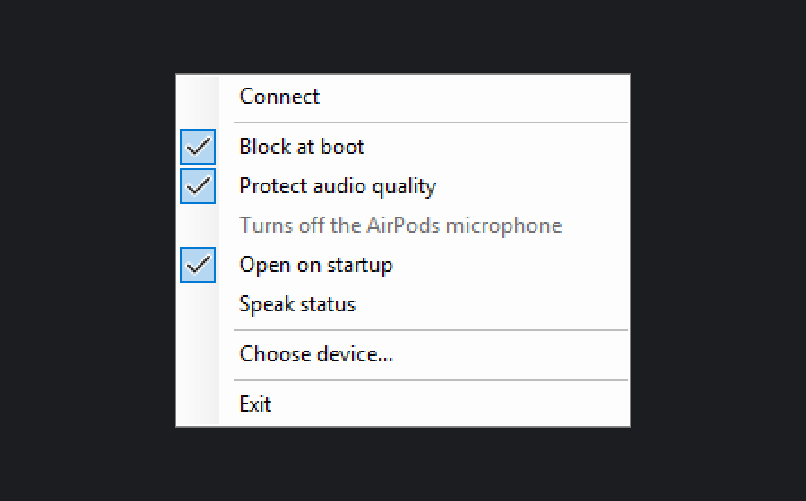
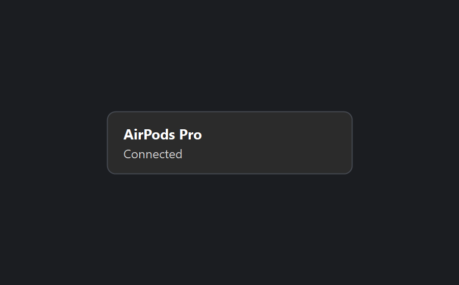
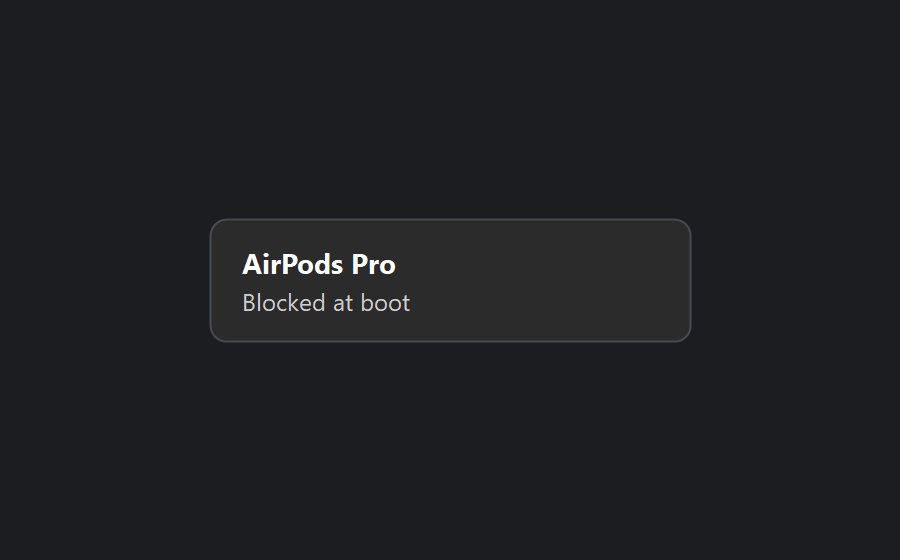
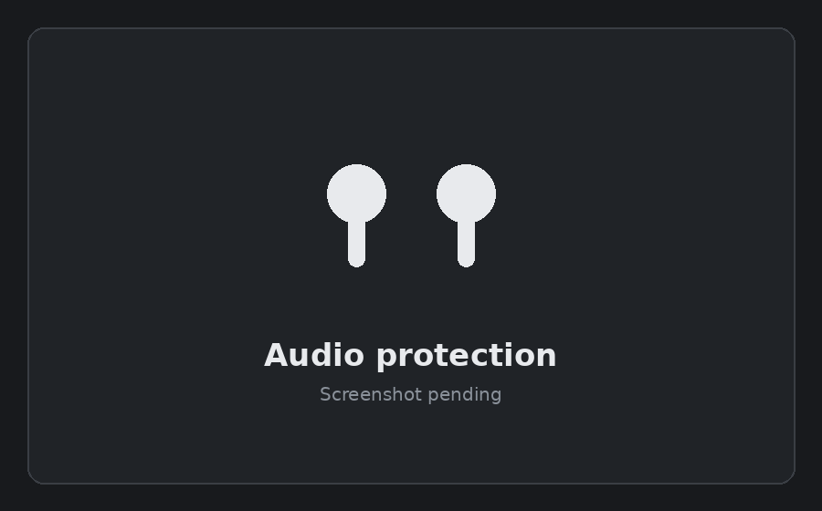
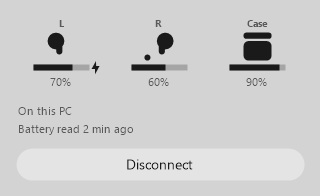
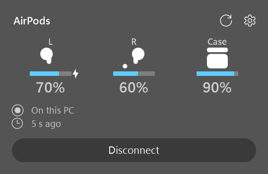
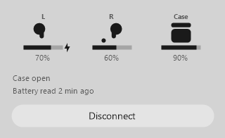

# Overview

This page is for anyone using Earshot, not just for engineers. It explains
what the tray icon shows, what each menu item does, and what the small cards
near the tray mean, without needing to know how any of it is built. For the
mechanism behind it, see [architecture.md](architecture.md).

## What Earshot is for

Windows connects every paired Bluetooth device the moment the PC turns on.
For a pair of AirPods that is usually the wrong moment: they get pulled off a
phone mid-call or mid-podcast, with nothing on the PC actually wanting them
yet. Earshot stops that by switching the AirPods off at the Windows level
while nobody is using them on this PC, and switches them straight back on
with a click on the card when someone is.

It also stops something quieter: Windows can drop a Bluetooth headset from
its normal stereo sound down to a narrow, phone-call-quality channel the
moment any program opens a microphone. Earshot can turn that fallback off for
the AirPods, so a browser tab asking for a microphone cannot pull them down
to that channel while it is on. Turning it on costs you the AirPods
microphone on this PC.

## The tray icon

Left-click the icon to open a card, then click Connect or Disconnect on it,
whichever they are not already doing. The icon itself shows which of four
states they are in:

| Icon | Meaning |
|---|---|
| Outlined earbuds | Disconnected |
| Solid earbuds | Connected |
| Faded solid earbuds | Busy: connecting, disconnecting or allowing |
| Outlined earbuds with one diagonal slash | Blocked at boot |

Hovering over the icon reads `Earshot: <device name> - connected`, and
likewise `disconnected`, `blocked` or `not found`. If Earshot cannot read the
audio devices at all it says `unknown`, rather than guessing at one of the
four states.

<i>Pending: this picture was taken before the menu gained its widget, update and hand-back items. A new capture is owed. The list below is the current menu.</i>

## The right-click menu

Top to bottom, with the exact wording. Separators sit between the groups.

| Item | What it does |
|---|---|
| `Safe mode: no device actions` | A caption, not a command. Shown only when Earshot is running in a mode that turns every device action off, used for testing. |
| `Connect`, or `Disconnect` when connected | The same as the button on the card the tray icon opens. Greyed out while a change is already under way. |
| `Play from a phone` | Shown only once this setting is turned on. Opens a submenu listing the phones paired in Windows that can send audio to this PC, with `Refresh the list` and, once one is open, `Stop playing from <name>`. Greyed out before Windows 10 version 2004 (build 19041). |
| `Block at boot` | A tick. Keeps the AirPods' device nodes disabled while they are not in use. Turning it on before setup has run starts setup. The tick shows what is in force; when the setting cannot be read it shows neither state. |
| `Hand back on shut down, sleep and Exit` | A tick. Releases the AirPods and blocks the device nodes again when you shut down, restart, sleep or choose Exit. See [below](#handing-the-airpods-back). |
| `Protect audio quality` | A tick, on by default. Turns off the Hands-Free profile, described above. |
| `Turns off the AirPods microphone` | A caption under that setting, always visible and never clickable, telling you plainly what it costs. |
| `Open on startup` | A tick, on by default. Writes one value named `Earshot` under the current user's `Run` key, with the `--startup` argument. Earshot has to be running for it to put the block back once you stop using the AirPods, so this keeps it running from sign-in. |
| `Speak status`, or `Speak status (no voice)` when no speech voice is installed | A tick, off by default. Clicking it does not itself speak anything. |
| `Show on the taskbar` | A tick. Whether the gauge (or, when it cannot be placed, the tray icon) shows the AirPods widget. |
| `Left click connects straight away` | A tick, off by default. A left click on the gauge or icon then connects or disconnects at once instead of opening the card. |
| `Card when the case opens` | A tick. Whether the case-open card may appear. It stays off in practice until Earshot can tell the lid is open, which set-up cannot prove. |
| `Low battery alert` | A tick. |
| `Threshold` | A submenu of 10% to 90% in steps of 10, greyed out while the alert is off. |
| `Set up battery` | Starts battery set-up. Reads `Set up battery (Bluetooth is off)` and is greyed out while Earshot's listener is not running. |
| `Name your other device...` | Sets the label used in "On your <name>". |
| `Choose device...` | Lists the Bluetooth devices paired to this PC, so you can point Earshot at a different one, for instance if your AirPods were renamed, so that the default match "AirPods" no longer fits. Choosing one pins it, and points the elevated worker at the same device. A device that cannot play audio from this PC, a phone for instance, is refused. |
| `Set up Earshot...` | Runs the one-time setup. Offered only when nothing is installed. Once Earshot is installed, in any state, the next item takes its place. |
| `Repair Earshot...` | Offered whenever Earshot is installed, healthy, damaged, older or newer than the running copy. One administrator prompt. See [Repair](#repair). |
| `Check for updates` | Looks for a newer release. Downloads nothing. See [Updates](#updates). |
| `Check automatically` | A tick, off by default. Contacts GitHub once a day when on. |
| `Exit` | Closes Earshot. With Block at boot on and the AirPods not in use, it blocks the device nodes first. With Hand back ticked and the AirPods in use on this PC, it lets them go first, then blocks the device nodes. With Hand back off, which is the default, and the AirPods in use, it closes without blocking and says so: "Closed while in use, so the AirPods are not blocked." |

A shortcut typed into the settings file for connect, audio protection or block
at boot is shown beside the item's own label, as `Block at boot
(<shortcut>)`. The two default shortcuts (see [Shortcuts](#shortcuts)) do not
appear in the menu.

 

## The connect and disconnect card

A small card appears near the tray with the device name and what is
happening, then closes itself without taking the focus away from whatever you
were doing. If the AirPods do not arrive the ordinary way, the card says so
honestly, for instance "Trying another way" while Earshot works around a
driver refusal.

<i>The card Earshot shows near the tray when the AirPods connect.</i>

 

## The boot block

With Block at boot ticked, the AirPods' device nodes are disabled the moment
they stop being used. The block is designed so that Windows has nothing to page
at the next boot: a disabled node is meant to stay disabled through a restart,
so nothing has to run at shutdown. The power cycle test that checks this (test
08) has not run yet, and a shut down with Fast Startup on is not covered.

<i>The card Earshot shows when the AirPods are blocked at boot.</i>

 

## Audio quality protection

With Protect audio quality ticked, Windows has no Hands-Free profile left to
fall back to, so a browser tab or a game asking for a microphone cannot pull
the AirPods down to a narrow voice channel. This does not make the sound
better than usual; it stops something else from making it worse. The tray
says plainly that the setting turns off the AirPods microphone on this PC
while it is on.

Connecting can need the setting off for a moment, because the quick reconnect
Earshot uses depends on the very profile this setting turns off. If Windows
refuses the quicker way, the card says "Trying another way": Earshot turns
the protection off, connects, then turns it back on, and the microphone works
again on this PC while that runs. If putting the protection back fails, the
card says "Connected, but audio quality protection did not apply." and the
microphone stays available until the next connect fixes it.

<i>The notice Earshot shows when audio quality protection is switched on.</i>

 

## Shortcuts

Shortcuts are on by default. Ctrl+Alt+Shift+A connects, which means it
switches the AirPods to this PC. Ctrl+Alt+Shift+D disconnects, which means it
switches them to the phone. On the settings page (the gear on the card) each
one can be changed, by pressing the new keys, or cleared.

A shortcut runs the same thing the button does, and shows the same card with
the result. If another program already holds a shortcut, Earshot says so on the
card and under that shortcut's row on the settings page. If a second press
arrives while an earlier one is still running, the last press wins: a press for
the other direction replaces the one in flight, and a press for the same
direction changes nothing.

Older settings files are read like this. A shortcut the file already holds is
kept. A file written before the two shortcuts existed and never given a typed
shortcut keeps the defaults, and if that file said shortcuts were off, they are
read as on. Once the file is saved it is not read that way again, so turning
shortcuts off stays off. A default that another of your own shortcuts already
uses is left empty. Shortcuts for toggle connection, audio protection, block at
boot and speak status can still be typed into the settings file.

## Switching between the phone and this PC

A switch to this PC is a connect, and a switch to the phone is a disconnect.
The labels stay Connect and Disconnect. Earshot times every switch it starts,
from one monotonic clock, and writes one line to the log for each: `Switch
to-pc:` or `Switch to-phone:`, with the phases the handover went through, how
it started (click, menu or shortcut) and, for a connect, which path it took.
Each line measures that one switch. No sitting on the real AirPods has
recorded any yet (test 16 is pending), so this page gives no timings.

## Speak status and Play from a phone

Neither has had a live run, and both are off by default.

**Speak status.** Off until turned on from the menu. Earshot speaks only from
a fixed, short list of phrases: Connected, Disconnected, Blocked at boot,
Allowed at boot, Connect failed, Block failed. No device name, address or
number ever reaches the speech engine, and it says nothing for a state it only
assumed, such as connecting or unknown; the tooltip is shown instead. It uses
the speech voices already installed on Windows.

**Play from a phone.** Off until turned on in the settings file. It turns this
PC into a Bluetooth speaker a paired phone can send audio to, through a
Windows API built for it. The phone has to already be paired in Windows
Settings; Earshot cannot pair it itself, because Windows does not support
in-app pairing for a desktop program. Your own AirPods are never offered as the
source, only one device plays at a time, and the feature never touches the
boot block, the scheduled tasks or elevation. It is released when Earshot exits
and when Windows is closing it. It needs Windows 10 version 2004 (build 19041)
or later, which every Windows 11 has. It has never been run against a real
phone, so whether this PC's Bluetooth radio offers the source role at all, and
what turning it on does to an AirPods link already open, are both open
questions.

## Handing the AirPods back

If the AirPods are playing from this computer when you shut down, restart,
put the computer to sleep, or choose Exit, Earshot lets go of them and stops
this computer grabbing them straight back. In order: release, disconnect,
confirm, block. If the disconnect does not confirm, the block is still sent.
What happens to the AirPods after that is not something this computer
decides: they go back to whatever device they prefer, which has been the phone
every time this was tried; Earshot cannot choose the device for them, command
the phone, or see what the phone does.

Sleep works the same way, on a much shorter clock, because Windows gives an
application far less time to act before the computer actually sleeps than it
gives at shut down. Exit has no Windows deadline, so it uses the shut-down
cap, and a stuck disconnect does not stop the block.

**Hand back on shut down, sleep and Exit** is off by default. Tick it in the
right-click menu, or on the settings page. Until you do, Exit while the AirPods
are in use does not block them, and the hand-back service does nothing at shut
down. The tests cover the hand-back against stand-ins. It has
not been tried on a real shut down, sleep or Exit (tests 17, 18 and 20 are
pending).

**The honest limits.** This needs Earshot running. A power cut, a forced
shutdown, or the battery reaching a critical level gives Windows no chance
to run it at all, because none of those send Earshot any notice. When that
happens, the fallback is the same one Earshot always has: the block Earshot
runs at the next start-up. That fallback can lose the race, so the AirPods
may connect to this computer briefly before it catches up and blocks them
again.

## Pausing when the AirPods leave this PC

On by default, and a row on the settings page. If this PC was playing to the
AirPods when they leave it, Earshot pauses playback so the sound does not jump
to the speakers. It acts before Earshot's own disconnects (Disconnect, the
hand-back, a fast switch) and as soon as it sees the AirPods leave any other
way, such as the phone taking them. It never resumes anything.

Windows does not say which output a media session is using, so Earshot pauses
the one media session that is playing, whichever output it uses. With two
playing, it pauses none. It pauses nothing when this PC was not playing to the
AirPods. Each decision is written to the log on a `Pause on leave:` line with
its reason. No live run yet (test 21 is pending).

## Updates

**Check for updates** in the menu and on the settings page looks at the latest
release on GitHub and says whether it is newer. **Check automatically** does
the same once a day after startup; it is off by default because a check
contacts GitHub. A check downloads nothing. Nothing downloads until you press
**Update**. Update works from any copy that is running, including one unzipped
in a download folder, as long as Earshot is installed in Program Files.

When you press Update, Earshot downloads the release zip and checks it against
the `.sha256` file published with it. The installed Earshot then checks the zip
again, from a folder only administrators can write, and installs from there,
after one administrator prompt. The program that runs with that prompt is
always the installed one, never the copy you were running.

If nothing is installed, the card says to set up first and offers **Set up
Earshot** on the same card. If something is installed but cannot be used (its
program is missing, or its folder can be changed by a standard user), the card
says to repair first and offers **Repair Earshot**.

A copy that is not the installed one, started while Earshot is installed, says
so on one card and offers **Switch to it**: this copy closes and the installed
one starts. Such a copy never points **Open on startup** or the Start menu
shortcut at itself, so the next start from either is the installed copy.

### Repair

**Repair Earshot...** is in the menu whenever Earshot is installed, and on the
settings page in the Updates section. Earshot first reads every installed file
and checks it against the list the release published, and checks that the
install folder can be changed only by administrators. Then:

- If every file matches, the installed Earshot repairs itself after one
  administrator prompt: it registers the scheduled tasks, the hand-back service,
  the machine settings and the device file again, exactly as setup does.
- If a file is missing or does not match, nothing in the install folder is
  trusted. Earshot downloads the release of the version you have installed,
  checks it against the `.sha256` file published with it, and hands it to the
  installed Earshot's update, so the files come back only from checked bytes.
- If the installed `Earshot.exe` is missing, or its folder is not safe, or the
  running copy is newer than the installed one, the running copy's own setup
  puts a new install in place.

Your settings, battery set-up and chosen AirPods are kept. How the repair ended
is recorded where the next start can say it, in case the card has gone.

What the checksum does and does not protect against: it catches a damaged or
cut-short download, and a file that differs from what the release lists. It
does not protect against a compromised release or account, because the
checksum comes from the same release and the app is not signed.

## Shutdown safety

Once Windows says the session is ending, Earshot refuses to start a connect,
an allow, or a setting change from any trigger, and says so on a card. A
block that is already due still runs, and one known to have failed is tried
once more. A close request from Windows, such as the one the Restart Manager
can send, is treated the same as choosing Exit.

The same refusal covers a sleep hand-back too, even though sleep is not a
session end in Windows' own terms: every menu item, keyboard shortcut and
click is refused with its own card while either hold is running, so nothing
can start a change that would fight what the hand-back is doing.

If the Earshot icon has been closed, a small background service, installed by
setup and removed by uninstall, can block the AirPods at shut down instead. It
acts only when Block at boot and Hand back are both on, and Hand back is off by
default. It blocks and never disconnects them, so the AirPods may stay
connected until the computer is off. It has not had a live run, does not cover a shut down with Fast Startup
on, and whether a restart gives it the shut-down notice is not proved. See
[architecture.md](architecture.md#handing-the-airpods-back-at-shut-down-and-sleep).

For what this does and does not guarantee when the PC is actually shut down,
see [requirements.md](requirements.md#what-it-does-not-do) and
[verification.md](verification.md).

## The AirPods widget

Alongside the tray icon, Earshot can show a small gauge on the taskbar, and
from it a card with more detail. It works by listening to the AirPods' own
Bluetooth broadcast, the same short signal a phone reads for its own battery
widget, rather than needing them connected to this PC. That is also why it has
firm limits; see [below](#what-the-widget-cannot-know). The widget has not had
a live run.

**The gauge.** The earbud mark with a ring round it in your Windows accent
colour. The ring fills to the lower proved bud's battery, that number sits
beside it, and a charging mark appears when a bud is proved to be charging.
The ring changes colour when the battery is at or below the low battery
threshold. The gauge has four looks, and its tooltip says why:

| When | What the gauge shows | Tooltip |
|---|---|---|
| On this PC with a proved reading no older than an hour | The ring, the number, and a charging mark when it applies | Three lines: `AirPods` (or `Charging`, or `Low battery`), then the buds with a proved figure such as `L 70%   R 60%`, then `Read just now` or `Read 2 min ago` |
| On this PC, no reading yet because battery is not set up | The earbud mark alone | `Battery not set up` |
| On this PC, but the last reading is older than an hour | The earbud mark alone | `No recent reading` |
| Not on this PC | The earbud mark, faded | `Not on this PC` |
| Not on this PC, and your AirPods are near and in use on another device | The earbud mark and a phone | `On your iPhone`, or the label you set |

A reading older than one hour counts as no recent reading. A bud with no
proved figure is left out of the tooltip, never shown as a dash or a guess.

**Where it sits.** On the taskbar, at the right end by default, 8 pixels left
of the notification area, or next to the apps, 4 pixels after the last app
button. Choose with **Gauge position** on the settings page. If there is no
free space on the taskbar, or Earshot cannot read the taskbar at all, the
gauge steps aside and the ordinary tray icon takes over, without asking.

**Staying visible.** When Start, a flyout or a taskbar click covers the gauge,
Earshot raises it again. Every hide, show, cover and raise is written to the
log with a reason and the window's class only, never a title. One failed read
of the taskbar does not move or hide the gauge; it stays where it is until
three reads in a row have failed.

<i>Pending: this picture shows the gauge before the ring design, drawn by Earshot's own code from made-up values. A new capture is owed.</i>

 

Left-click the gauge, or the tray icon when that is what is showing, to open
the card. With **Left click connects straight away** on, a left click connects
or disconnects immediately instead. It is off by default.

**The card.** A title with a gear that opens the settings page. Then three columns, left bud, right bud and
case, each with a bar, its number and a charging mark when proved. A column
whose figure is not proved says "No reading". Once any part has a proved figure the
columns show; with none at all they are replaced by one **Set up battery** button. Below them: one line
for where the AirPods are (`On this PC`, `On your iPhone` or the label you
set, `Not in use`, or `Not seen yet`), one line for when the battery was last
read (`Battery read 2 min ago`, or `Battery not read yet`), a line
`Version <number> is available` when a check found a newer release, and the
Connect or Disconnect button.

<i>Pending: this picture shows the card before the gear and settings page, drawn by Earshot's own code from made-up values and composited onto one measured sample of Windows' own card backdrop colour. A new capture is owed.</i>

 

<i>Pending: the same earlier card in the dark theme. A new capture is owed.</i>

 

### Set up battery

**Set up battery** is on the card (in place of the columns while nothing is
proved) and in the menu. It has three steps.

1. **Open your AirPods case next to this PC.** Earshot listens for 20 seconds
   and looks for one set it can call yours: your two buds count as one set,
   and messages from a nearby iPhone are ignored. It takes the strongest set,
   with at least three messages, clearly stronger than any other. If it hears none,
   it says "Couldn't find your AirPods"; if more than one set is near, "More
   than one set of AirPods is near". If Bluetooth is off it says so.
2. **What does your iPhone show?** Three pickers, left bud, right bud and
   case, each in steps of 10 (pick the nearest 10; if it ends in 5, pick the
   lower), plus a **Charging** toggle for each.
3. **Done.** The card says what was saved.

The picker values are evidence only. They are never shown as a reading. Earshot
keeps what it saw on this PC, and a field is shown only once that evidence
proves it:

- **Bud order and the case each need two set-ups that agree with your
  iPhone.** A first set-up says "Set up once more to confirm it". Set-ups
  where both buds read the same say so, and are no help for bud order.
- **A set-up that disagrees withdraws the field** an earlier pair had proved.
- **Charging marks** show only when their own evidence agrees.
- **In-ear and the lid cannot be proved by set-up**, because three battery
  pickers say nothing about ears or the lid. So ear detection, auto-pause and
  the case-open card stay off.

The threshold for "your case, near this PC" is set 10 decibels under the
weakest message the case sent. That, the three messages and the 10 decibel gap
are choices made in the code, not measured facts about the AirPods.

### The settings page

The gear on the card opens it. Rows, top to bottom:

| Row | Default | Notes |
|---|---|---|
| Gauge position | Right end | Right end, or next to apps |
| Other device | `iPhone` | The label used in "On your <name>", up to 40 characters |
| Pause when a bud comes out | On | Says "Earshot cannot yet tell when a bud is in your ear." while in-ear is not proved, and does nothing until it is |
| Pause when AirPods leave this PC | On | See [above](#pausing-when-the-airpods-leave-this-pc) |
| Case-open card | On | Says "Earshot cannot yet tell when the case lid is open." while the lid is not proved |
| Low battery alert | 20% | A stepper, 10% to 90% in steps of 10 |
| Left click connects | Off | |
| Hand back on shut down, sleep and Exit | A tick, as in the menu | See [above](#handing-the-airpods-back) |
| Shortcuts: Connect | Ctrl+Alt+Shift+A | Press keys to change, Clear to remove; a chord another app holds is named under the row |
| Shortcuts: Disconnect | Ctrl+Alt+Shift+D | The same |
| Updates: Check for updates | | A Check button, and the version you have |
| Updates: Repair Earshot | | A Repair button. Only there while Earshot is installed |
| Updates: Check automatically | Off | Contacts GitHub when on |

The low battery alert's own on and off is a tick in the right-click menu.

**The case-open card.** When the AirPods' own case is opened near the PC, the
same card would appear by itself near the taskbar for a few seconds, then
close, using the same timing Windows' own notifications use on this PC. It
never connects the AirPods by itself: opening a case only ever shows the card;
pressing its button still takes a real click. Because a set-up cannot prove
the lid, it does not appear yet.

<i>Pending: an earlier drawing of the case-open card from made-up values. A new capture is owed.</i>

 

**The low battery alert.** A Windows notification, or the card if a
notification cannot be shown, the moment a part with a proved figure first
reads at or below a threshold, 20% by default. It only fires again once that
part has read at least one 10% step back above the threshold, so a value
sitting on the edge does not repeat itself. Nothing fires for a field that has
not been proved.

**Pausing when a bud comes out.** A row on the settings page, on by default.
It would pause what this PC is playing to the AirPods when a bud is taken out,
and never resume something the owner paused himself. It acts only once in-ear
state has been proved, which set-up cannot do, so it does nothing today.

### What the widget cannot know

- **The other device is your own label, not a reading.** "On this PC" comes
  from Windows itself. "On your iPhone", or whatever you type, is only your
  name for "in use, somewhere that is not this PC"; the AirPods never say what
  they are actually connected to.
- **Battery is a snapshot, never live.** It is read in steps of 10% (0, 10,
  20 to 100) from the last broadcast Earshot heard, and the tooltip and card
  say how long ago that was. It is never interpolated and never shown as
  current, and a reading older than an hour counts as none.
- **Ear detection and the lid cannot be proved by set-up.** Until something
  else proves them, ear detection, auto-pause and the case-open card stay off.
- **The widget hears everyone's AirPods nearby, not only yours.** A room full
  of the same model broadcasts the same way yours do. What keeps a stranger's
  AirPods off the card is the rule below.

### Whose AirPods it shows

Set-up records your AirPods' model, colour and the strength of the broadcast
as your claim. After that, a broadcast is only shown as yours if all of the
following hold:

- the model and colour match the claim;
- the signal clears the strength recorded at that claim;
- and the battery is consistent with the last reading Earshot has for you:
  the same, lower, or one step (10%) higher, and higher by more than that
  only while the matching charging mark is set.

Being connected to this PC does not, by itself, count as proof: the same
checks run every time, connected or not. Re-syncing after a jump the rule
cannot explain is a re-claim, which means opening the case by the PC again.

Short of all of the above, Earshot fails closed: no battery, no case-open
card, no pause. Nothing is recorded about an unmatched device beyond a count
of how many were seen.

**The accepted risk.** Because "the same or lower" always passes, a
stranger's AirPods of the same model and colour, near the PC with a lower
battery reading than your last one, could be shown as yours. The owner
accepted that risk rather than make the rule stricter and risk missing his own
AirPods on a false alarm.

### What still needs a kernel driver

Noise control, battery to the nearest 1%, and a few other AirPods features
are not built, and are not close to being built, because of what Windows
does and does not let an ordinary program do. See
[architecture.md](architecture.md#what-still-needs-a-kernel-driver) for the
full list and why, with sources.

### Privacy

The widget only listens. It never connects to, or sends anything to, a
Bluetooth device to get this data, and it does not need the AirPods paired
to this PC at all. Nothing about a device that turns out not to be yours is
kept, beyond a count of how many were seen. Your set-up records, claim and
proof stay on this PC, in `%LOCALAPPDATA%\Earshot\widget`; they are never part
of the repository.
